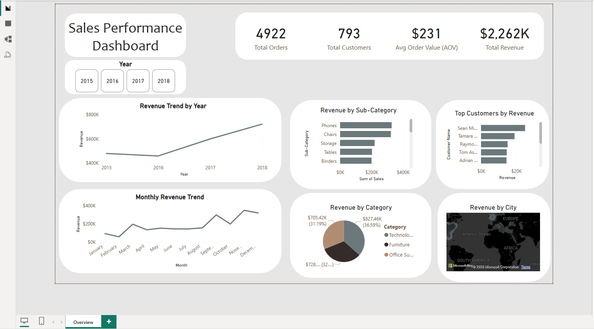

# 📊 Sales Performance Dashboard

Interactive Sales Performance Dashboard built using **Power BI**, **DAX**, and **Power Query**.

---

## 📷 Dashboard Preview



---

## 📌 Project Overview

This dashboard analyzes sales performance and provides interactive insights into:

- Total Revenue
- Total Orders
- Total Customers
- Average Order Value (AOV)
- Revenue Trend Analysis
- Monthly Sales Performance
- Category & Sub-Category Analysis
- Top Customers
- Geographic Sales Distribution

---

## 📈 Key KPIs

| KPI | Value |
|------|------:|
| Total Revenue | $2.26M |
| Total Orders | 4,922 |
| Total Customers | 793 |
| Average Order Value | $231 |

---

## 🛠 Tools Used

- Power BI
- Power Query
- DAX
- Microsoft Excel

---

## 📂 Repository Structure

```
Sales-Performance-Dashboard
│
├── Dashboard/
│   ├── Sales Performance Dashboard.pbix
│   └── Sales Performance Dashboard.pdf
│
├── Dataset/
│   └── Superstore.csv
│
├── Images/
│   └── dashboard.png
│
├── README.md
└── LICENSE
```

---

## 🚀 Skills Demonstrated

- Data Cleaning
- Data Modeling
- DAX Measures
- Interactive Dashboard Design
- Business Intelligence
- Data Visualization

---

## 👤 Author

**Abdulaziz Alsabaan**

- LinkedIn: https://www.linkedin.com/in/abdulaziz-alsabaan
- GitHub: https://github.com/abdulazizalsabaan
